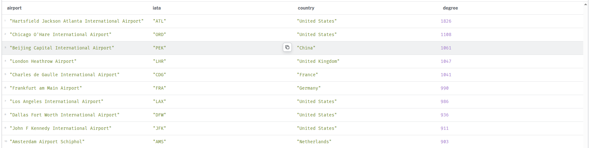
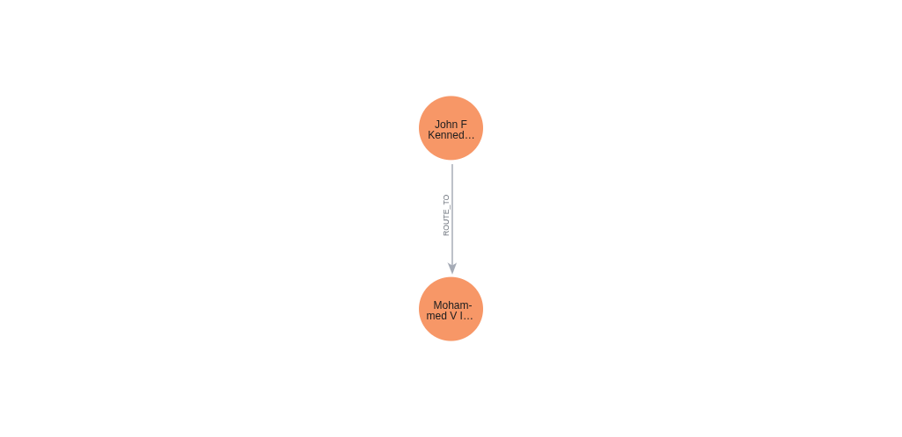
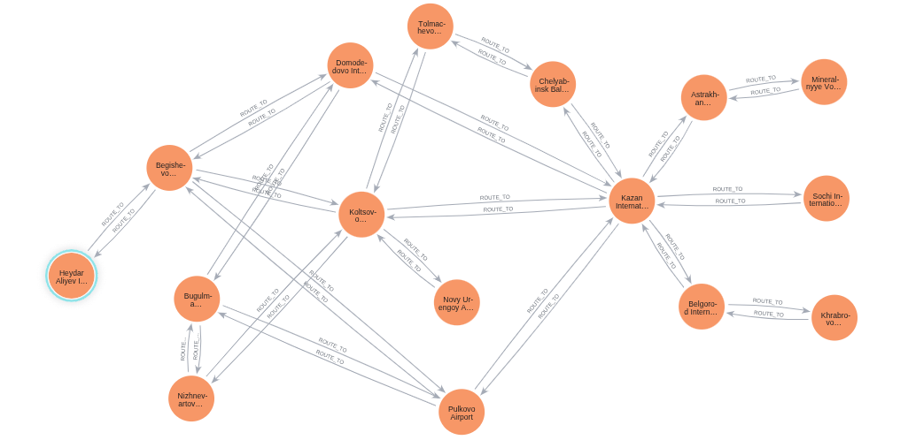

# Neo4j OpenFlights Graph

A graph analysis project built with **Neo4j** using the **OpenFlights** dataset to model airport connectivity and flight routes.

## Project Overview

This project models a global air transport network as a graph in Neo4j.

- **Nodes** represent airports
- **Relationships** represent direct routes between airports

The goal is to use graph modeling and Cypher queries to explore:

- major airport hubs
- domestic vs international connectivity
- shortest paths between airports
- airports with the widest international reach
- route network structure
- and more insightful analyses

### Files used

- `airports.dat`
- `routes.dat`

### Final cleaned files

- `airports_clean.csv`
- `airports_graph.csv`
- `routes_clean.csv`
- `routes_graph.csv`

## Data Cleaning

### Airports cleaning decisions

For `airports.dat`:

- converted `\N` values to null
- kept only rows where `type = "airport"`
- removed rows missing critical fields:
  - `airport_id`
  - `name`
  - `country`
  - `latitude`
  - `longitude`
- used `airport_id` as the primary key
- kept optional missing values like `iata`, `city`, and timezone fields

### Routes cleaning decisions

For `routes.dat`:

- converted `\N` values to null
- removed rows with missing source or destination airport IDs
- removed rows whose airport IDs were not found in the cleaned airport table
- removed self-loop routes
- removed exact duplicate rows
- created `routes_graph.csv` as the graph-ready route file

## Data Dictionary

this is the data dictionary for the Neo4j OpenFlights Graph project.

## Project Structure

```text
neo4j-openflights-graph/
├─ README.md
├─ data/
│  ├─ raw/
│  │  ├─ airports.dat
│  │  └─ routes.dat
│  └─ clean/
│     ├─ airports_clean.csv
│     ├─ airports_graph.csv
│     ├─ routes_clean.csv
│     └─ routes_graph.csv
├─ cypher/
│  ├─ 01_constraints.cypher
│  ├─ 02_import_airports.cypher
│  ├─ 03_import_routes.cypher
│  └─ 04_queries.cypher
├─ scripts/
│  ├─ clean_airports.py
│  ├─ clean_routes.py
│  ├─ airport_graph_clean.py
|  └─ clean_airlines.py
└─ docs/
   └─ screenshots/
```
## Analysis Results

This section shows example results generated from the Neo4j graph after importing the cleaned OpenFlights airport and route data.

### 1. Top 10 Airport Hubs

This query identifies the most connected airports in the graph by total route degree.

**Main insight:**  
The graph highlights major global hubs such as ATL, ORD, PEK, LHR, CDG, FRA, LAX, DFW, JFK, and AMS.



---

### 2. Domestic vs International Routes

This query compares routes that stay within the same country against routes that cross country borders.

**Main insight:**  
The network contains both strong domestic and international connectivity, with international routes slightly exceeding domestic ones.


---

### 4. Shortest Path Between Two Airports

This query finds the shortest route path between two selected airports in the graph.

**Main insight:**  
In this example, the graph shows a direct 1-hop path between John F. Kennedy International Airport and Mohammed V International Airport.



---

### 5. Graph Visualization 40 Airport Hubs

This visualization shows a sample airport-route subgraph inside Neo4j Browser.

**Main insight:**  
The graph structure clearly reveals hub-and-spoke connectivity patterns, with highly connected airports acting as central nodes.



## Source of the data

data source : https://openflights.org/data.php